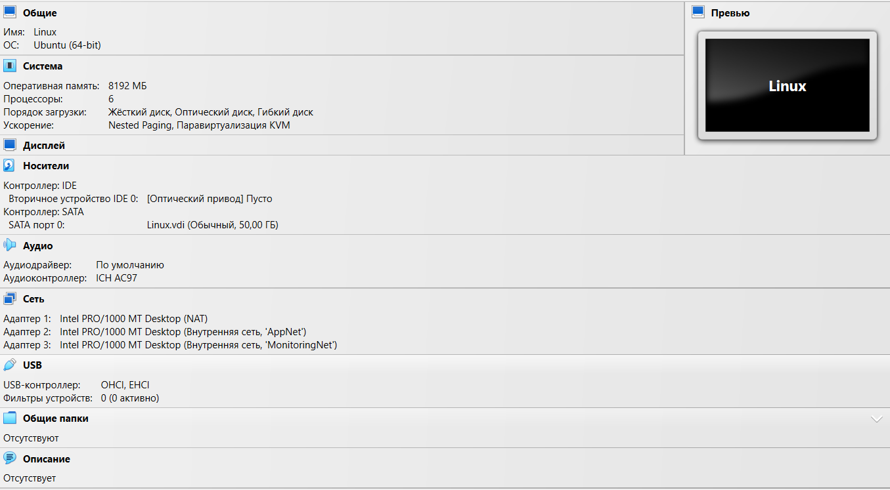
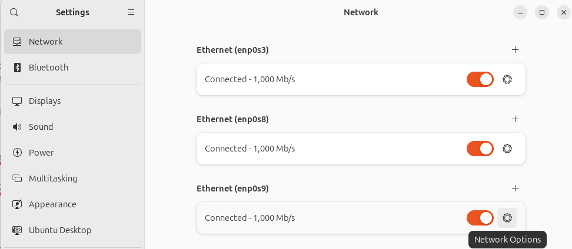
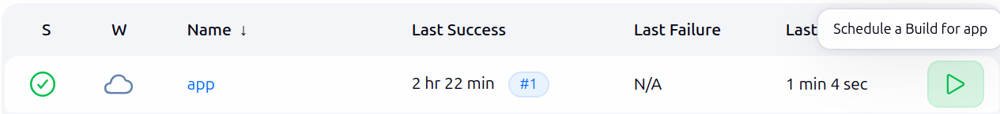
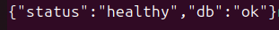
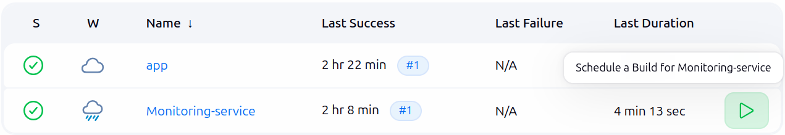
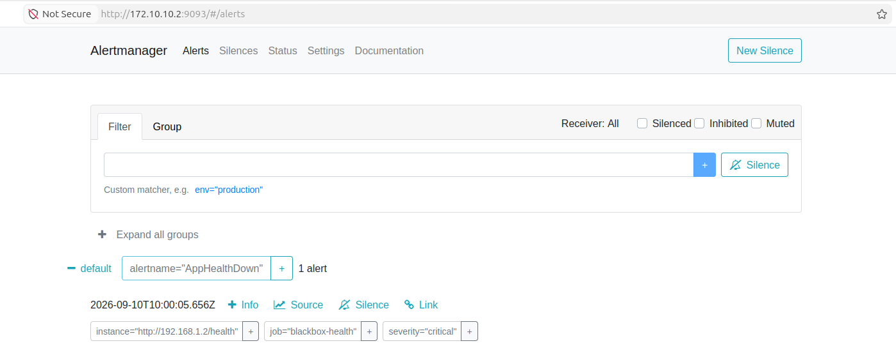

# web-service-ha-lab

Отказоустойчивый стенд веб-сервиса с CI/CD и мониторингом.

Проект демонстрирует навыки работы с Linux, сетями, Docker, Jenkins, Prometheus и Grafana.
Стенд состоит из трёх виртуальных машин (Router, Application, Monitoring), связанных между собой через отдельные подсети.

---

## Содержание

- [Архитектура](#архитектура)
- [IP-адресация](#ip-адресация)
- [Шаг 1. Создание виртуальных машин и настройка сети](#шаг-1-создание-виртуальных-машин-и-настройка-сети)
- [Шаг 2. Настройка SSH-доступа](#шаг-2-настройка-ssh-доступа)
- [Шаг 3. Маршрутизация между подсетями](#шаг-3-маршрутизация-между-подсетями)
- [Шаг 4. Установка и настройка Jenkins](#шаг-4-установка-и-настройка-jenkins)
- [Шаг 5. Развёртывание стека мониторинга](#шаг-5-развёртывание-стека-мониторинга)
- [Проверка работоспособности](#проверка-работоспособности)
- [Демонстрационный инцидент](#демонстрационный-инцидент)

---

# Архитектура

Стенд состоит из трёх виртуальных машин созданных в VirtualBox:

| Машина | Роль | Назначение | Используемый образ |
|--------|------|------------|--------------------|
| Router | Маршрутизатор и Jenkins | Связывает две подсети, запускает CI/CD | ubuntu-24.04.1-desktop-amd64.iso |
| Application | Приложение | FastAPI + PostgreSQL + Nginx + экспортёры метрик | ubuntu-24.04.1-live-server-amd64.iso |
| Monitoring | Мониторинг | Prometheus + Grafana + Alertmanager + Blackbox | ubuntu-24.04.1-live-server-amd64.iso |


## IP-адресация

| Устройство | Интерфейс | Адрес | Назначение | Шлюз |
|------------|-----------|-------|------------|------|
| Router | enp0s8 | 192.168.1.1/30 | Сеть appNet | 192.168.1.2 |
| Router | enp0s9 | 172.10.10.1/30 | Сеть MonitoringNet | 172.10.10.2 |
| Application | enp0s8 | 192.168.1.2/30 | Сеть appNet | 192.168.1.1 |
| Monitoring | enp0s8 | 172.10.10.2/30 | Сеть MonitoringNet | 172.10.10.1 |

## Шаг 1. Создание виртуальных машин и настройка сети

Создаём три ВМ: Router, Application, Monitoring.
Router соединяется с Application и Monitoring через разные подсети и разные интерфейсы, но Application и Monitoring должны иметь возможность обращаться друг к другу.

Router имеет NAT интерфейс и два внутренних интерфейса - по одному в каждой подсети:

- `appNet` - сеть для приложения
- `MonitoringNet` - сеть для мониторинга

На Application должно быть два интерфейса NAT и внутренний в подсети `appNet`.
На Monitoring аналогично, но в подсети `MonitoringNet`.

Пример готовых интерфейсов


Благодаря маршрутизации Application и Monitoring смогут обращаться друг к другу через Router.

На Router выставляем адреса через настройки Ubuntu. Заходим в настройки, выбираем сеть, и выставляем адреса согласно таблице маршрутизации.



Раздаём адреса, пример для Application:

```
sudo nano /etc/netplan/99-hostonly.yaml
```

Содержимое файла:
```
network:
  version: 2
  ethernets:
    enp0s8:
      dhcp4: false
      addresses:
        - 192.168.1.2/30
```

Применяем настройки:

```
sudo netplan apply
```

Если при `ip a` нет нужных адресов - проверьте, на какой порт нужно поставить адрес:

```
ip link show
```


## Шаг 2. Настройка SSH-доступа

На каждой машине устанавливаем SSH-сервер:

```
sudo apt update && sudo apt install openssh-server
sudo systemctl enable --now ssh
```

Проверяем, что со всех машин можно подключиться по SSH:

```bash
ssh USER_NAME@IP_addres
```

## Шаг 3. Маршрутизация между подсетями

Включаем IP-форвардинг на Router:

```
echo "net.ipv4.ip_forward=1" | sudo tee -a /etc/sysctl.conf
sudo sysctl -p
```

Разрешаем трафик между интерфейсами:

```
sudo iptables -I FORWARD -i enp0s8 -o enp0s9 -j ACCEPT
sudo iptables -I FORWARD -i enp0s9 -o enp0s8 -j ACCEPT
```

Добавляем маршрут на Application:

Открываем netplan: `sudo nano /etc/netplan/99-hostonly.yaml`

После строки addresses: добавляем маршрут к сети Monitoring через Router:

```bash
      routes:
        - to: 172.10.10.2/30
          via: 192.168.1.1
```

Применяем `sudo netplan apply`.
Добавляем маршрут на Monitoring. Аналогично, только с другими адресами - маршрут к сети App через Router.

## Шаг 4. Установка и настройка Jenkins

Jenkins будет стоять на Router - у него есть доступ в обе подсети.

Он будет по SSH подключаться к Application-серверу, стягивать репозиторий, собирать образ и поднимать `docker-compose`.
Если проверка `/health` упадёт - Jenkins откатит контейнеры к предыдущей стабильной версии.

### 4.1. Создание SSH-ключа для Jenkins

На Router создаём SSH-ключ для подключения к Application без запроса пароля:

```
ssh-keygen -t rsa -b 4096 -N "" -f ~/.ssh/id_rsa_jenkins
```

Копируем публичный ключ на Application-сервер:

```
ssh-copy-id -i ~/.ssh/id_rsa_jenkins.pub app@192.168.1.2
```

На Router копируем публичный ключ на Monitoring-сервер:

```
ssh-copy-id -i ~/.ssh/id_rsa_jenkins.pub monitoring@172.10.10.2
```


### 4.2. Запуск Jenkins в Docker-контейнере

Переходим в папку с Jenkins и запускаем контейнер:

```
cd Jenkins
docker compose up -d
```

> **Примечание.** Если нужно перезапустить контейнер вручную, используйте команду:
>
> ```
> docker run -d --name jenkins -p 8080:8080 -p 50000:50000 jenkins/jenkins:lts &
> ```

Смотрим пароль администратора Jenkins:

```
docker logs jenkins 2>&1 | grep -A 5 "Jenkins initial setup"
```

### 4.3. Первоначальная настройка Jenkins

1. Открываем в браузере: `http://localhost:8080`
2. Вводим пароль администратора, полученный из логов.
3. Устанавливаем предлагаемые плагины.

### 4.4. Установка плагинов SSH

1. Заходим в Jenkins → **Manage Jenkins** → **Manage Plugins**.
2. Переходим на вкладку **Available**.
3. В поле поиска вводим `SSH`.
4. Находим плагин **SSH Pipeline Steps** и отмечаем галочкой.
5. Также устанавливаем плагин **SSH Agent**.
6. Перезапускаем Jenkins.

### 4.5. Добавление учётных данных для Application

Переходим в **Manage Jenkins** → **Credentials** и добавляем credential типа **SSH Username with private key**:

- **ID**: `app-server-ssh`
- **Username**: `app`
- **Private key**: содержимое приватного ключа

Приватный ключ нужно посмотреть командой:

```
cat /var/jenkins_home/.ssh/id_rsa_jenkins
```

### 4.6. Настройка доступа к Git

1. Заходим под своим аккаунтом в GitLab/GitHub.
2. Добавляем SSH-ключ в аккаунт.
3. Тот же ключ добавляем в Jenkins, как в пункте 4.5, только с другими **ID** и **Username**

В Jenkins выбираем добавить **Pipeline** выбираем **Pipeline script from SCM**:

- **SCM**: `Git`
- **Repository URL**: `https://github.com/Nik7Zol/web-service-ha-lab` #Тут будет ваш репозиторий
- **Branches to build**: `*/main`
- **Credentials**: выбираем добавленный SSH-ключ

### 4.7. Запуск pipeline

Запускаем pipeline в Jenkins.

> **Возможная ошибка** - пользователь `app` не добавлен в группу `docker`.
> Заходим вручную на Application-сервер и выполняем:
>
> ```
> sudo usermod -aG docker app
> sudo visudo -f /etc/sudoers.d/app-user
> ```
>
> Вставляем в файл:
>
> ```
> app ALL=(ALL) NOPASSWD: /usr/bin/apt, /usr/bin/docker, /usr/bin/docker-compose, /usr/sbin/usermod
> ```



### 4.8. Проверка после сборки

В выводе консоли Jenkins должно быть **SUCCESS**.
Проверяем доступность приложения:

```
curl http://192.168.1.2/health
```

Должно вернуться:

```
{"status":"healthy","db":"ok"}
```



## Шаг 5. Развёртывание стека мониторинга

### 5.1. Проверка доступа из Monitoring в Application

С Monitoring-сервера проверяем доступ до приложения:

```
curl http://192.168.1.2/health
```

Должно вернуться:

```
{"status":"healthy","db":"ok"}
```

### 5.2. Добавление учётных данных для Monitoring в Jenkins

Переходим в **Manage Jenkins** → **Credentials** и добавляем credential типа **SSH Username with private key**:

- **ID**: `monitoring-server-ssh`
- **Username**: `monitoring`
- **Private key**: содержимое ключа

Приватный ключ в данном случае использую тот же ключ:

```
cat /var/jenkins_home/.ssh/id_rsa_jenkins
```

### 5.3. Настройка sudo без пароля на Monitoring

Заходим на Monitoring-сервер:

```
ssh monitoring@172.10.10.2
```

Настраиваем sudo без пароля для нужных команд:

```
sudo visudo -f /etc/sudoers.d/monitoring-user
```

Содержимое файла:

```
monitoring ALL=(ALL) NOPASSWD: ALL
```

Добавляем пользователя в группу `docker`:

```
sudo usermod -aG docker monitoring
newgrp docker
```

### 5.4. Запуск pipeline для Monitoring

Запускаем отдельный pipeline `Jenkinsfile_Monitoring`.



После успешной сборки проверяем состояние таргетов Prometheus.

### 5.5. Проверка таргетов Prometheus

Открываем в браузере:

```
http://172.10.10.2:9090/targets
```

Все таргеты должны быть в состоянии **UP**:

- `prometheus` (`localhost:9090`) - UP
- `node-exporter-monitoring` (`node-exporter:9100`) - UP
- `cadvisor-monitoring` (`cadvisor:8080`) - UP
- `node-exporter-app` (`192.168.1.2:9100`) - UP
- `cadvisor-app` (`192.168.1.2:8080`) - UP
- `blackbox-health` (`http://192.168.1.2/health`) - UP

### 5.6. Проверка Grafana

Открываем `http://172.10.10.2:3000`, вход `admin / admin`.

1. **Configuration** → **Data Sources** - должен быть Prometheus (провижн из файла).
2. **Explore** → выбираем Prometheus → запрос `up` → **Run Query** → должны появиться данные.

### 5.7. Проверка Alertmanager

Открываем `http://172.10.10.2:9093` - пока там пусто.


Правила алертов можно посмотреть в Prometheus:

```
http://172.10.10.2:9090/rules
```

Там должны быть загружены `AppHealthDown` и `NodeDown`.

---

## Проверка работоспособности

### На Application-сервере

```
docker ps
curl http://localhost/health
curl http://localhost/db
curl http://localhost:9100/metrics | head
curl http://localhost:8080/metrics | head
```

### С Router

```
curl http://192.168.1.2/health
curl -s http://192.168.1.2:9100/metrics | head
curl -s http://192.168.1.2:8080/metrics | head
```

### С Monitoring-сервера

```
curl http://localhost:9090/-/healthy
curl http://localhost:3000/api/health
curl http://localhost:9093/-/healthy
```

---

## Демонстрационный инцидент

### Сценарий

1. Убеждаемся, что всё зелёное - Prometheus targets UP, приложение отвечает.

2. Останавливаем контейнер приложения:

    ```
    ssh app@192.168.1.2
    docker stop app-fastapi
    ```

3. Наблюдаем в Prometheus:

   - Через ~15–30 секунд таргет `blackbox-health` станет **DOWN** (потому что `/health` не отвечает).
   - Открываем `http://172.10.10.2:9090/alerts` - алерт `AppHealthDown` перейдёт в состояние **Pending**, затем в **Firing**.

4. Наблюдаем в Alertmanager:

   Открываем `http://172.10.10.2:9093` - увидим активный алерт с меткой `severity: critical`.

    

5. Восстанавливаем сервис:

   ```
   docker start app-fastapi
   ```

6. Убеждаемся, что алерт закрылся - через ~30 секунд в Alertmanager алерт исчезнет (статус `resolved`).


---

## Используемые технологии

- **ОС**: ubuntu-24.04.1-desktop-amd64.iso, ubuntu-24.04.1-live-server-amd64.iso
- **Виртуализация**: VirtualBox
- **Сети**: netplan, ip_forward, iptables/nftables
- **Контейнеризация**: Docker, Docker Compose
- **Приложение**: Python, FastAPI, PostgreSQL, Nginx
- **CI/CD**: Jenkins
- **Мониторинг**: Prometheus, Grafana, Alertmanager, Node Exporter, cAdvisor, Blackbox Exporter


